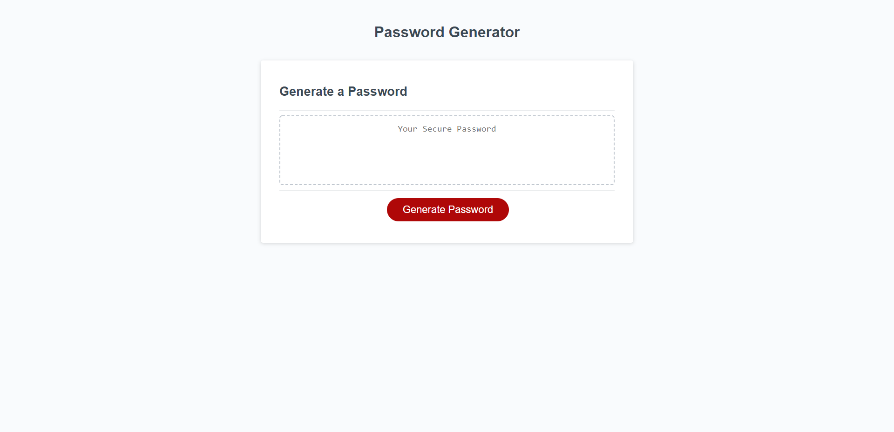

# Password-Generator
## Description
In todays world of "online everything" it is important to stay 100% safe. From online banking, shopping, grocery shopping, jobs, etc. hackers are on the prowl looking for their next vulnerable victim. With malware, ransomware, and viruses flooding systems, most of these are caused by unsecure passwords. In the last couple years, massive fortune 500 companies, oil pipelines, MSP companies, and even the Pentagon have had issues with hackers due to simple passwords. NO MORE!! Introducing the random password generator, there is no excuse to having an unsafe password. 

Try it out for yourself. Hit generate and follow the prompts in order to get your secure password. 

  

## Screenshot

  

## Website URL
https://benbushman98.github.io/Password-Generator/
